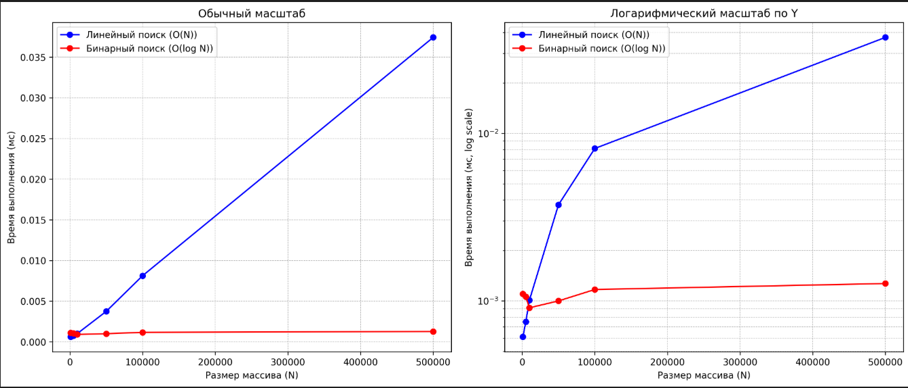
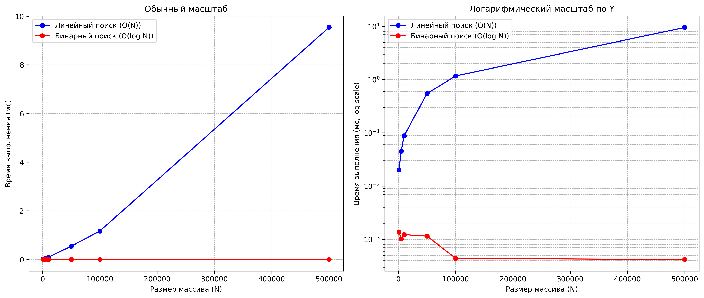

# Лабораторная работа №1 
## Введение в алгоритмы. Сложность. Поиск.
### Цель работы: Освоить понятие вычислительной сложности алгоритма. Получить практические навыки реализации и анализа линейного и бинарного поиска. Научиться экспериментально подтверждать теоретические оценки сложности O(n) и O(log n).

### Теория (кратко):
- Сложность алгоритма: Характеризует количество ресурсов (времени и памяти), необходимых алгоритму для обработки входных данных объема n.
- Асимптотический анализ: Анализ поведения алгоритма при стремлении n к бесконечности. Позволяет абстрагироваться от констант и аппаратных особенностей.
- O-нотация («О-большое»): Верхняя асимптотическая оценка роста функции. Определяет наихудший сценарий работы алгоритма.
- Линейный поиск (Linear Search): Последовательный перебор всех элементов массива. Сложность: O(n).
- Бинарный поиск (Binary Search): Поиск в отсортированном массиве путем многократного деления интервала поиска пополам. Сложность: O(log n). Требует предварительной сортировки (O(n log n)).

### Теоретические ожидания

Линейный поиск (O(n))
Каждый элемент массива проверяется последовательно.
При размере массива N время работы растёт прямо пропорционально N.

В среднем придётся просмотреть N/2 элементов.

В худшем случае — все N.

Бинарный поиск (O(log n))
Массив делится пополам на каждом шаге.
Количество операций — примерно log₂(N).
Это растёт очень медленно: при увеличении массива в 1000 раз глубина поиска растёт только примерно в 10 раз.

### Практические результаты

Замеры показали, что:

Линейный поиск действительно растёт почти линейно с увеличением размера массива.

Бинарный поиск остаётся практически постоянным (слабый рост виден только на логарифмическом графике).

#### Для target = 5

Замеры времени выполнения для алгоритма суммирования массива:
|Алгоритм |  Размер (N) |  Время (мс)  | Время/N (мкс)|
|---------|-------------|--------------|--------------|
|Linear:  |     1000    |   0.0006     |     0.0006   |
|Binary:  |     1000    |   0.0011     |     0.0011   |
|Linear:  |     5000    |   0.0007     |     0.0001   |
|Binary:  |     5000    |   0.0011     |     0.0002   |
|Linear:  |    10000    |   0.0010     |     0.0001   |
|Binary:  |    10000    |   0.0009     |     0.0001   |
|Linear:  |    50000    |   0.0037     |     0.0001   |
|Binary:  |    50000    |   0.0010     |     0.0000   |
|Linear:  |   100000    |   0.0081     |     0.0001   |
|Binary:  |   100000    |   0.0012     |     0.0000   |
|Linear:  |   500000    |   0.0374     |     0.0001   |
|Binary:  |   500000    |   0.0013     |     0.0000   |

#### Для targte = 500

Замеры времени выполнения для алгоритма суммирования массива:
| Алгоритм | Размер N | Время (мс) | Время/N (мкс) |
| -------- | -------- | ---------- | ------------- |
| Linear   | 1000     | 0.0201     | 0.0201        |
| Binary   | 1000     | 0.0014     | 0.0014        |
| Linear   | 5000     | 0.0453     | 0.0091        |
| Binary   | 5000     | 0.0010     | 0.0002        |
| Linear   | 10000    | 0.0880     | 0.0088        |
| Binary   | 10000    | 0.0012     | 0.0001        |
| Linear   | 50000    | 0.5463     | 0.0109        |
| Binary   | 50000    | 0.0012     | 0.0000        |
| Linear   | 100000   | 1.1701     | 0.0117        |
| Binary   | 100000   | 0.0004     | 0.0000        |
| Linear   | 500000   | 9.5388     | 0.0191        |
| Binary   | 500000   | 0.0004     | 0.0000        |

