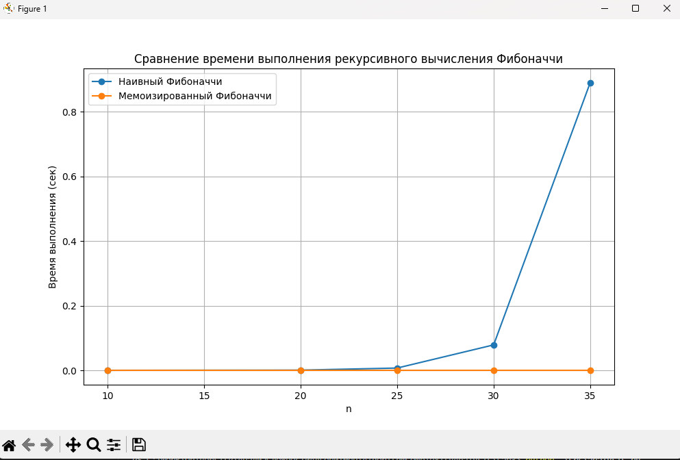

# Отчет по лабораторной работе 3
# Рекурсия

**Дата:** 2025-10-06
**Семестр:** 3 курс 1 полугодие - 5 семестр
**Группа:** ПИЖ-Б_О-23-1(2)
**Дисциплина:** Анализ сложности алгоритмов
**Студент:** Проценко Дмитрий Максимович

## Цель работы
Освоить принцип рекурсии, научиться анализировать рекурсивные алгоритмы и
понимать механизм работы стека вызовов. Изучить типичные задачи, решаемые рекурсивно, и освоить
технику мемоизации для оптимизации рекурсивных алгоритмов. Получить практические навыки
реализации и отладки рекурсивных функций

## Теоретическая часть
- Рекурсия: Процесс, при котором функция прямо или косвенно вызывает саму себя для решения задачи.
- Базовый случай (условие выхода): Обязательное условие, которое прекращает рекурсивные вызовы и предотвращает зацикливание.
- Рекурсивный шаг: Шаг, на котором задача разбивается на более простую подзадачу того же типа и производится рекурсивный вызов.
- Глубина рекурсии: Количество вложенных вызовов функции. Ограничена размером стека вызовов.
- Стек вызовов (Call Stack): Структура данных, которая хранит информацию о незавершенных вызовах функций (локальные переменные, адрес возврата).
- Мемоизация (Memoization): Техника оптимизации, позволяющая избежать повторных вычислений результатов функций для одних и тех же входных данных путем сохранения ранее вычисленных результатов в кеше (например, в словаре)

Для проведения тестов использовался апарат со следующими комплектующими:
Характеристики ПК для тестирования:
- Процессор: Intel Core i7-12700H @ 2.30GHz
- Оперативная память: 16 GB DDR4
- ОС: Windows 11
- Python: 3.13.1

## Практическая часть

1. Реализовать классические рекурсивные алгоритмы.
2. Проанализировать их временную сложность и глубину рекурсии.
3. Реализовать оптимизацию рекурсивных алгоритмов с помощью мемоизации.
4. Сравнить производительность наивной рекурсии и рекурсии с мемоизацией.
5. Решить практические задачи с применением рекурсии.

### Ключевые фрагменты кода

~~~ python
def factorial(n: int) -> int:
    """Вычисление факториала числа n рекурсивно."""
    if n == 0 or n == 1: # Базовые случаи
        return 1
    return n * factorial(n - 1)

# Временная сложность: O(n)
# Глубина рекурсии: O(h)

def fibonacci(n: int) -> int:
    """Рекурсивное вычисление n-го числа Фибоначчи."""
    if n <= 1: # Базовые случаи 
        return n
    return fibonacci(n - 1) + fibonacci(n - 2) # Временная сложность: O(2^n)

# Временная сложность: O(2^n)
# Глубина рекурсии: O(h)

def fast_power(a: float, n: int) -> float:
    """Быстрое возведение числа a в степень n (через деление степени на 2)."""
    if n == 0: # Базовые случаи 
        return 1
    if n % 2 == 0:
        half = fast_power(a, n // 2) # Рекурсивный вызов
        return half * half
    else: # n нечетное
        return a * fast_power(a, n - 1) # Рекурсивный вызов

# Временная сложность: O(log n)
# Глубина рекурсии: O(log h)

import os

def binary_search(arr, target, left=0, right=None):
    """Рекурсивный бинарный поиск."""
    if right is None: # Инициализация правой границы O(1)
        right = len(arr) - 1
    if left > right: # Проверка границ O(1)
        return -1
    mid = (left + right) // 2 # Вычисление среднего индекса O(1)
    if arr[mid] == target: # Проверка на равенство O(1)
        return mid # Элемент найден O(1)
    elif arr[mid] > target: # Рекурсивный вызов для левой половины O(log n)
        return binary_search(arr, target, left, mid - 1) 
    else: # Рекурсивный вызов для правой половины O(log n)
        return binary_search(arr, target, mid + 1, right)

# Временная сложность: O(log n)
# Глубина рекурсии: O(log h)

def walk_directory(path, indent=0, current_depth=1):
    """Рекурсивный обход файловой системы с выводом дерева каталогов и файлов."""
    if not os.path.exists(path):
        print("Путь не существует")
        return 0
    max_found_depth = current_depth
    for item in sorted(os.listdir(path)):
        full_path = os.path.join(path, item)
        print(" " * indent + f"- {item} - {current_depth}")
        if os.path.isdir(full_path):
            sub_depth = walk_directory(full_path, indent + 2, current_depth + 1)
            max_found_depth = max(max_found_depth, sub_depth)
    return max_found_depth

# Временная сложность: O(N), где N — количество файлов и папок
# Глубина рекурсии: O(H), где H — максимальная глубина вложенности каталогов

def hanoi(n, source="A", target="C", auxiliary="B"):
    """Решение задачи Ханойских башен для n дисков."""
    if n == 1:
        print(f"Переместить диск 1 с {source} на {target}")
        return
    hanoi(n - 1, source, auxiliary, target)
    print(f"Переместить диск {n} с {source} на {target}")
    hanoi(n - 1, auxiliary, target, source)

# Временная сложность: O(2^n)
# Глубина рекурсии: O(h)

import time
from recursion import fibonacci

# Мемоизированная версия
def fibonacci_memo(n: int, memo=None) -> int:
    if memo is None: # Инициализация словаря мемоизации при первом вызове O(1)
        memo = {} # O(1)

    if n == 0: # Базовые случаи
        return 0 # O(1)
    if n == 1: # O(1) 
        return 1 # O(1)
    
    if n in memo: # Проверяем, не вычисляли ли мы уже это значение
        return memo[n] # O(1)

    memo[n] = fibonacci_memo(n - 1, memo) + fibonacci_memo(n - 2, memo) # Рекурсивный шаг с сохранением результата O(n)
    return memo[n] # O(1)

# Сравнение производительности
if __name__ == "__main__":
    n = 35

    start = time.time()
    print(f"Наивный Фибоначчи({n}) = {fibonacci(n)}")
    print(f"Время работы (наивный): {time.time() - start:.4f} сек")

    start = time.time()
    print(f"Мемоизированный Фибоначчи({n}) = {fibonacci_memo(n)}")
    print(f"Время работы (мемоизация): {time.time() - start:.4f} сек")

import time
import matplotlib.pyplot as plt
from recursion import fibonacci
from memoization import fibonacci_memo 
from recursion_tasks import walk_directory, hanoi
import os

# 1. Экспериментальное исследование времени вычисления Фибоначчи
n_values = [10, 20, 25, 30, 35]
times_naive = []
times_memo = []

for n in n_values:
    start = time.time()
    fibonacci(n)
    end = time.time() - start
    times_naive.append(end)
    print( f"time for fibonacci - {end}" )

    start = time.time()
    fibonacci_memo(n)
    end = time.time() - start
    times_memo.append(end)
    print( f"time for memo fibonacci - {end}" )

# 2. Визуализация времени выполнения
plt.figure(figsize=(10, 6))
plt.plot(n_values, times_naive, marker='o', label='Наивный Фибоначчи')
plt.plot(n_values, times_memo, marker='o', label='Мемоизированный Фибоначчи')
plt.xlabel('n')
plt.ylabel('Время выполнения (сек)')
plt.title('Сравнение времени выполнения рекурсивного вычисления Фибоначчи')
plt.legend()
plt.grid(True)
plt.savefig('fibonacci_time_comparison.png')
plt.show()

# 3. Измерение максимальной глубины рекурсии для обхода файловой системы
def max_depth_walk(path, current_depth=0):
    if not os.path.exists(path):
        return current_depth
    max_depth = current_depth
    for item in os.listdir(path):
        full_path = os.path.join(path, item)
        if os.path.isdir(full_path):
            max_depth = max(max_depth, max_depth_walk(full_path, current_depth + 1))
    return max_depth

# Пример использования (заменить 'root_dir' на путь к вашей тестовой директории)
root_dir = '.'  # текущий каталог
max_depth = walk_directory(root_dir)
print(f"Максимальная глубина рекурсии для обхода файловой системы: {max_depth}")

# 4. Ханойские башни
print("\nРешение задачи Ханойских башен для n=3")
hanoi(3)

# 5. Анализ результатов
print("\nАнализ результатов:")
print("Наивный алгоритм Фибоначчи имеет экспоненциальный рост времени выполнения O(2^n),")
print("потому что каждая функция вызывает две предыдущие функции рекурсивно, что ведет к множественному пересчету одних и тех же значений.")
print("Мемоизация изменяет сложность до линейной O(n), так как каждое значение вычисляется только один раз и сохраняется в словаре.")

~~~

## Результаты выполнения

### Пример работы программы

Время вычисления числа фибоначи для разных размерностей с мемоизацией и без
10
time for fibonacci - 2.0503997802734375e-05
time for memo fibonacci - 6.4373016357421875e-06
20
time for fibonacci - 0.0006556510925292969
time for memo fibonacci - 6.198883056640625e-06
25
time for fibonacci - 0.007130622863769531
time for memo fibonacci - 7.867813110351562e-06
30
time for fibonacci - 0.08012580871582031
time for memo fibonacci - 1.3113021850585938e-05
35
time for fibonacci - 0.8801770210266113
time for memo fibonacci - 1.430511474609375e-05

Подсчет глубины файловой системы с отчетом от директории Lab3
- README.md - 1
- docs - 1
- fibonacci_time_comparison.png - 1
- src - 1
  - __pycache__ - 2
    - memoization.cpython-313.pyc - 3
    - recursion.cpython-313.pyc - 3
    - recursion_tasks.cpython-313.pyc - 3
  - analysis.py - 2
  - fibonacci_time_comparison.png - 2
  - memoization.py - 2
  - recursion.py - 2
  - recursion_tasks.py - 2
- Отчет - 1
  - ОТЧЕТ.md - 2
Максимальная глубина рекурсии для обхода файловой системы: 3

Решение задачи Ханойских башен для n=3
Переместить диск 1 с A на C
Переместить диск 2 с A на B
Переместить диск 1 с C на B
Переместить диск 3 с A на C
Переместить диск 1 с B на A
Переместить диск 2 с B на C
Переместить диск 1 с A на C

## Ответы на контрольные вопросы

1. Что такое базовый случай и рекурсивный шаг в рекурсивной функции? Почему отсутствие базового случая приводит к ошибке?

Базовый случай — это условие завершения рекурсии, при котором функция перестает вызывать саму себя. Рекурсивный шаг — это часть функции, где она вызывает себя с более простыми параметрами. Если базового случая нет, рекурсия становится бесконечной и вызывает переполнение стека.

2. Объясните, как работает механизм мемоизации. Как он меняет временную сложность вычисления чисел Фибоначчи по сравнению с наивной рекурсией?

Мемоизация сохраняет результаты предыдущих вызовов функции, чтобы не пересчитывать их заново. Благодаря этому временная сложность вычисления чисел Фибоначчи уменьшается с 
𝑂(2^𝑛) до O(n).

3. В чем заключается основная проблема глубокой рекурсии и как она связана со стеком вызовов?

Основная проблема глубокой рекурсии — переполнение стека вызовов из-за большого числа вложенных вызовов функций. Каждый вызов занимает место в стеке, и при его переполнении программа аварийно завершается.

4. Задача о Ханойских башнях решается рекурсивно. Опишите алгоритм решения для 3 дисков.

Сначала нужно переместить два верхних диска на вспомогательный стержень, затем третий (самый большой) — на целевой, и после этого два диска со вспомогательного — на целевой стержень. Этот процесс повторяется рекурсивно, пока не будет достигнут базовый случай с одним диском.

5. Рекурсивный и итеративный алгоритмы могут решать одни и те же задачи. Назовите преимущества и недостатки каждого подхода.

Рекурсия делает код короче и понятнее, особенно для задач с естественной рекурсивной структурой, но расходует больше памяти из-за стека вызовов. Итерация эффективнее по памяти и скорости, но иногда требует более сложной логики и дополнительного кода.

## Приложения

